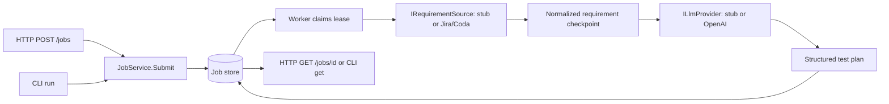

# Architecture

## Scope and boundaries

This repository implements requirement ingestion, structured planning and reviewed browser execution for an engineering quality system. External requirements, LLM calls, artifact uploads, source-control proposals, and browser execution all have typed ports. Read-only Jira/Coda ingestion and structured OpenAI planning are optional; defaults remain synthetic for offline demos. The separate Playwright smoke suite exercises this service. An explicit reviewed-manifest CLI path executes selected tests with the Playwright adapter and stores independent run results; see [execution](playwright-execution.md).

Domain has no infrastructure dependency. Orchestrator depends on Domain, JsonSchema.Net and the S3 SDK. Persistence depends on those two and Npgsql. Api is the composition root. Both HTTP and CLI use the same JobService and storage implementations. The standalone worker uses a generic host with graceful signal handling and no HTTP listener.

## Durable data and transitions

`Requirement` records source reference/revision, actors, preconditions, criteria, and risks. `TestCase` links steps and expected results to acceptance criterion IDs. `TestPlan` groups cases with assumptions, coverage gaps, and prompt version. `AgentDecision` stores provider audit metadata. Explicit execution creates separate `TestRun` records and local evidence; `FailureAnalysis` remains a contract for a later slice.

A `QualityJob` stores its request, normalized requirement, plan, decisions, transition history, timestamps, error code, and concurrency metadata as one aggregate. PostgreSQL stores it as JSONB alongside indexed claim fields. Each save atomically replaces the aggregate and updates status/revision; transitions and outputs therefore commit together. History is embedded, not a separate event-sourcing system.

Valid flow: `Queued → Normalizing → Planning → Completed`, or any nonterminal stage → `Failed`. A requirement must exist before Planning; a plan must exist before Completed. Terminal jobs cannot be claimed again. Explicit provider failures persist a sanitized `provider_failure` error. Cancellation leaves a nonterminal checkpoint for recovery.

PostgreSQL claims use `FOR UPDATE SKIP LOCKED` in a transaction. A claim has a random token, a five-minute lease, and an incremented revision. Every save checks revision, token, and unexpired lease using database time. Expired claims are reclaimable; stale owners cannot save. Workers resume the persisted stage after lease expiry. A provider operation may repeat if interrupted before its checkpoint: delivery is **at least once**, not exactly once.

There is no lease heartbeat yet. Remote ingestion has a 30-second deadline and structured planning a configurable total deadline capped at 80 seconds. Real operations longer than five minutes require lease renewal and bounded provider timeouts. Provider side effects must become idempotent before wiring external writes. The one-shot client waits at most two minutes; if another worker owns an interrupted job, the command may time out before its lease expires. The submitted job remains durable.

The file store uses an exclusive file lock across processes and atomic same-directory replacement. It is intended for a small local workspace on local disk, not network filesystems or multi-host deployments. It does not promise power-loss durability from an fsync journal. PostgreSQL is the deployment path.

Initialization serializes the initial `CREATE TABLE/INDEX IF NOT EXISTS` through a PostgreSQL transaction advisory lock. This is a bootstrap schema, not a production migration system; add ordered migrations before changing the schema in a deployed environment.

## Portable runtime

One image contains the published .NET 10 host, Node, pinned Playwright package/browsers, TypeScript workspace, versioned schemas, and prompts. API, worker, and one-shot modes change arguments only. Planning writes go to PostgreSQL and execution results to a dedicated named volume; Compose runs the app as `pwuser` with a read-only root filesystem and writable temporary storage. Optional MinIO storage holds uploaded evidence; local run metadata records bucket/object/checksum associations and an independent upload status. The Compose verification script independently tests a signed S3 round-trip and persistence. MinIO is pulled from its official Quay repository; a readiness check gates successful stack startup.

The package lockfiles are checked in. Playwright's package and browser image both use version 1.63.0, following [Playwright's Docker guidance](https://playwright.dev/docs/docker). The PostgreSQL adapter uses a shared NpgsqlDataSource as described in [Npgsql's usage guide](https://www.npgsql.org/doc/basic-usage.html). Base images use explicit release tags. For immutable promotion, build once, publish the result, and deploy the **resulting image digest** for every role; tags alone are not immutable registry identifiers. The image is not rebuilt or mutated to select a role. The `smoke` Compose profile also reuses this image to execute Chromium tests with output in writable temporary storage.

## Deliberate limits

- Live Jira/Coda/LLM access requires operator-supplied credentials; these integrations have fixture verification.
- Browser tests are generated from a reviewed action manifest. Arbitrary code, healing and remote PR creation are not implemented. Passing reviewed tests can be proposed as isolated Git patches; remote evidence upload is available through MinIO.
- No authentication, tenant isolation, API rate limiting, submission idempotency key, or cancellation endpoint yet.
- Test schemas validate wire shape; they do not prove coverage quality. The API validates incoming references, and smoke tests validate a real response against composed schemas. Runtime JSON Schema and traceability validation protects the structured planning boundary.
- Live planning loads hash-pinned plan/v2 prompt/schema assets. Stub mode stays offline.
- The SDK currently exposes the subset used by the smoke tests; JSON schemas and C# models define the complete contract. Generate full SDK types from schemas when extending execution.
- Filesystem fallback is for local development; PostgreSQL has no external queue dependency for this slice.
