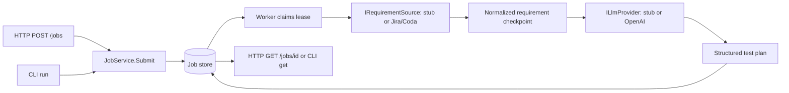

# Architecture

## Scope and boundaries

This repository implements requirement ingestion, structured planning, and reviewed or policy-approved browser execution for an engineering quality system. External requirements, LLM calls, artifact uploads, source-control proposals, and browser execution all have typed ports. Read-only Jira/Coda ingestion and structured OpenAI planning are optional; defaults remain synthetic for offline demos. The separate Playwright smoke suite exercises this service. An explicit reviewed-manifest CLI path executes selected tests with the Playwright adapter and stores independent run results; the Command Center/API also support non-production policy approval and bounded canary launch. See [execution](playwright-execution.md) and [Command Center autonomous execution](command-center.md#autonomous-execution).

Domain has no infrastructure dependency. Orchestrator depends on Domain, JsonSchema.Net and the S3 SDK. Persistence depends on those two and Npgsql. Api is the composition root. Both HTTP and CLI use the same JobService and storage implementations. The standalone worker uses a generic host with graceful signal handling and no HTTP listener by default; its optional authenticated [metrics listener](metrics.md) uses a web host and exposes only `/metrics`.

## Durable data and transitions

`Requirement` records source reference/revision, actors, preconditions, criteria, and risks. `TestCase` links steps and expected results to acceptance criterion IDs. `TestPlan` groups cases with assumptions, coverage gaps, and prompt version. `AgentDecision` stores provider audit metadata. Execution creates separate `ExecutionRequest` and `TestRun` records with local evidence; completed failures may receive an explicit persisted classification and review reason.

A `QualityJob` stores its request, normalized requirement, plan, decisions, transition history, timestamps, error code, and concurrency metadata as one aggregate. PostgreSQL stores it as JSONB alongside indexed claim fields. Each save atomically replaces the aggregate and updates status/revision; outputs and provider-operation records commit together; the following stage transition is a separate recoverable save. History is embedded, not a separate event-sourcing system.

Valid flow: `Queued → Normalizing → Planning → Completed`, or any nonterminal stage → `Failed` or `Cancelled`. A requirement must exist before Planning; a plan must exist before Completed. Terminal jobs cannot be claimed again. Explicit provider failures persist a sanitized `provider_failure` error. Worker shutdown leaves a nonterminal checkpoint; recovery safely repeats read-only imports but flags uncertain planning calls for review.

PostgreSQL claims use `FOR UPDATE SKIP LOCKED` in a transaction. A claim has a random token, a five-minute lease, and an incremented revision. Every save checks revision, token, and unexpired lease using database time. Expired claims are reclaimable; stale owners cannot save. Workers resume the persisted stage after lease expiry within [durable retry budgets](retry-budgets.md); exhausted claims become terminal without another provider call. The [provider-operation journal](provider-recovery.md) reuses persisted results. Interrupted read-only imports may repeat; planning operations with a recorded start and no saved result stop with a review-required error instead of being called again. Provider execution is not guaranteed exactly once.

Active attempts now [renew their leases](lease-renewal.md), with serialized checkpoint writes and bounded renewal attempts. Remote ingestion has a 30-second deadline and structured planning a configurable total deadline capped at 80 seconds. Lease renewal preserves ownership during long operations; provider deadlines remain independently bounded. Provider side effects must become idempotent before wiring external writes. The one-shot client waits at most two minutes; if another worker owns an interrupted job, the command may time out before its lease expires. The submitted job remains durable.

The file store uses an exclusive file lock across processes and atomic same-directory replacement. It is intended for a small local workspace on local disk, not network filesystems or multi-host deployments. It does not promise power-loss durability from an fsync journal. PostgreSQL is the deployment path.

Initialization applies ordered, checksummed [PostgreSQL migrations](database-migrations.md) under a transaction advisory lock. The operation journal uses the existing JSONB document. Migration 3 excludes Cancelled jobs from the pending-job index.

## Portable runtime

One image contains the published .NET 10 host, Node, pinned Playwright package/browsers, TypeScript workspace, versioned schemas, and prompts. API, worker, and one-shot modes change arguments only. Planning writes go to PostgreSQL and execution results to a dedicated named volume; Compose runs the app as `pwuser` with a read-only root filesystem and writable temporary storage. Optional MinIO or Azure Blob storage holds uploaded evidence; local run metadata records provider/container/object/checksum associations and an independent upload status. Command Center artifact reads remain server-side, validate per-run ownership, prefer the local copy, and use a stored association before remote fallback. The Compose verification script independently tests a signed S3 round-trip and persistence. MinIO is pulled from its official Quay repository; a readiness check gates successful stack startup.

The package lockfiles are checked in. Playwright's package and browser image both use version 1.63.0, following [Playwright's Docker guidance](https://playwright.dev/docs/docker). The PostgreSQL adapter uses a shared NpgsqlDataSource as described in [Npgsql's usage guide](https://www.npgsql.org/doc/basic-usage.html). Base images use explicit release tags. For immutable promotion, build once, publish the result, and deploy the **resulting image digest** for every role; tags alone are not immutable registry identifiers. The image is not rebuilt or mutated to select a role. The `smoke` Compose profile also reuses this image to execute Chromium tests with output in writable temporary storage.

## Deliberate limits

- Live Jira/Coda/LLM access requires operator-supplied credentials; these integrations have fixture verification.
- Browser tests are generated from a hash-bound action manifest. A person may approve it, or an active immutable non-production policy revision may approve and launch a conforming deterministic draft after atomically reserving lifetime, rolling-window, and concurrency budget. PostgreSQL is the deployment policy/workflow store; file stores remain single-host fallbacks. Autonomous operation is a leased, retryable state machine with idempotent triggers and durable checkpoints from trigger through classification. Its ID is also the deterministic execution-request ID, so restart reconciliation cannot duplicate a browser run. Policy gates and exhausted budgets pause the same workflow for review; cancellation propagates to queued or running execution and fences late results. Arbitrary code, healing, and remote PR creation are not implemented. Passing approved tests can be proposed as isolated Git patches; remote evidence upload is available through MinIO or Azure.
- API bearer-key authentication and submission idempotency are implemented. Tenant isolation and API rate limiting remain pending. Process-local [metrics](metrics.md) are implemented. Durable [job cancellation](job-cancellation.md) is implemented.
- Test schemas validate wire shape; they do not prove coverage quality. The API validates incoming references, and smoke tests validate a real response against composed schemas. Runtime JSON Schema and traceability validation protects the structured planning boundary.
- Live planning loads hash-pinned plan/v2 prompt/schema assets. Stub mode stays offline.
- The SDK currently exposes the subset used by the smoke tests; JSON schemas and C# models define the complete contract. Generate full SDK types from schemas when extending execution.
- Filesystem fallback is for local development; PostgreSQL has no external queue dependency for this slice.
